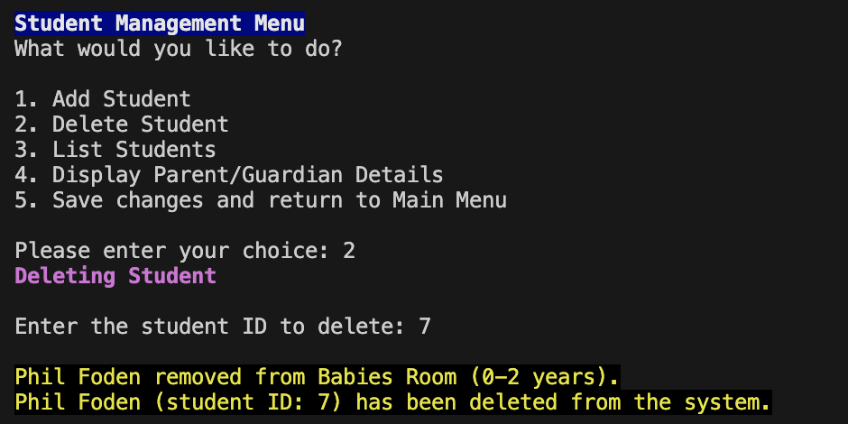
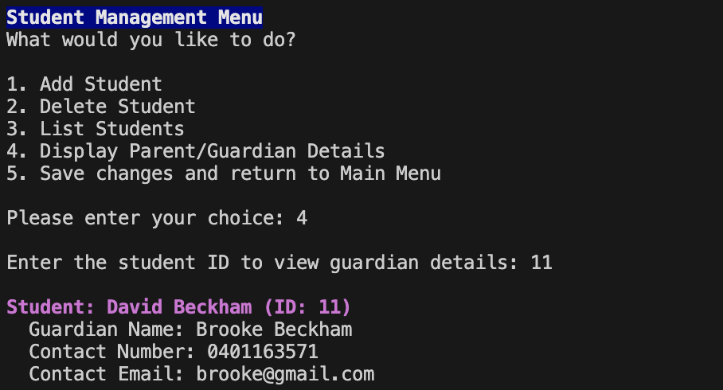

# Childcare Management Application

### Quick Overview
This is a terminal-based command-line interface (CLI) application created to manage both students and kitchen operations at a childcare center with a maximum capacity of 100 students. The application enables users to add, view, and delete student records, access details about their parents or guardians, manage daily kitchen menus, and track students' allergies efficiently.

## Table of Contents

1. [Application Setup](#application-setup)  
   - [Setting Up the Environment](#setting-up-the-environment)  
   - [Third-party Software Licensing and Security](#third-party-software-licensing-and-security)  
      - [License Compatibility](#license-compatibility)  
      - [Security Impact Overview](#security-impact-overview)  
      - [Important Notes](#important-notes)  

2. [Application Features](#application-features)
   - [Student Management Menu](#student-management-menu)
     - [Add Student](#add-student)
     - [Delete Student](#delete-student)
     - [List Students](#list-students)
     - [Display Parent/Guardian details](#display-parentguardian-details)
    - [Kitchen Management Menu](#kitchen-management-menu)
      - [Add/Update Menu for the Day](#addupdate-menu-for-the-day)
      - [Delete Menu for the Day](#delete-menu-for-the-day)
      - [List Menu for the Week](#list-menu-for-the-week)
      - [List students with allergies](#list-students-with-allergies)
    - [Data Persistence](#data-persistence)
    - [Styled Outputs](#styled-outputs)
    - [Error Handling and Input Validation](#error-handling-and-input-validation)
3. [Using the Application](#using-the-application)  
   - [Run the Application](#running-the-application)  
   - [Main Menu](#main-menu)  
   - [Option 1 - Student Management Menu](#option-1---student-management-menu)  
     - [Choice 1 - Add Student](#choice-1---add-student)  
     - [Choice 2 - Delete Student](#choice-2---delete-student)  
     - [Choice 3 - List Students](#choice-3---list-students)  
     - [Choice 4 - Display Parent/Guardian Details](#choice-4---display-parentguardian-details)  
     - [Choice 5 - Save Changes and Return to the Main Menu](#choice-5---save-changes-and-return-to-the-main-menu)  
   - [Option 2 - Kitchen Management Menu](#option-2---kitchen-management-menu)  
      - [Choice 1 - Add/Update Menu for the Day](#choice-1---addupdate-menu-for-the-day)  
      - [Choice 2 - Delete Menu for the Day](#choice-2---delete-menu-for-the-day)  
      - [Choice 3 - List Menu for the Week](#choice-3---list-menu-for-the-week)  
      -  [Choice 4 - List Students with Allergies](#choice-4---list-students-with-allergies)  
      -  [Choice 5 - Save Changes and Return to the Main Menu](#choice-5---save-changes-and-return-to-the-main-menu)  
   - [Option 3 - Exit](#option-3---exit)  

3. [Application Testing](#application-testing)
    - [Test for adding kitchen menu](#test-for-adding-a-kitchen-menu-test_add_menu_for_day)
    - [Test for adding a student](#test-for-adding-a-student-test_add_student)
    - [Running all tests at once](#run-all-tests-at-once)  


## Application Setup
Users can clone or fork the code of the application from its [GitHub repository](https://github.com/Donjella/assignment-2-CSA).

The application uses both in-built and external libraries:

1. [Colored](https://pypi.org/project/colored/)
2. [PrettyTable](https://pypi.org/project/prettytable/)
3. [JSON](https://pypi.org/project/colored/)  
4. [Pytest](https://docs.pytest.org/en/latest/) 
5. [Pytest Mock](https://pytest-mock.readthedocs.io/en/latest/) 
6. [Python datetime module](https://docs.python.org/3/library/datetime.html) 
7. [Python Random Module](https://docs.python.org/3/library/random.html) 

More information on their licensing, security and compatibility impact can be viewed in the Third-party software licensing and security section.

### Setting Up the Environment
 ***Note*** :The application is developed and tested on Python 3.12.5 and is confirmed to work on Unix-like systems (specifically macOS). Compatibility on other operating systems is not guaranteed. Below are the instructions for setting up the environment on macOS; please adjust as needed for your system.

1. Install dependencies using a virtual environment.  

```bash
# to set up virtual environment
python3 -m venv .venv

# activate virtual environment
source .venv/bin/activate
```
2. Create a .gitignore file and add .venv to avoid pushing the virtual environment packages to the GitHub repository.
3. **requirements.txt** file is included in the application's [GitHub repository](https://github.com/Donjella/assignment-2-CSA). Hence, users can quickly install project dependencies once the virtual environment is active.  

```bash
# Install dependencies from requirements.txt.
pip install -r requirements.txt

# ONLY if you wish to install dependencies manually. If you have installed from requirements.txt, you can ignore these:
pip install colored
pip install pytest
pip install pytest-mock
pip install prettytable
```
## Third-party software licensing and security
The application makes use of various third-party software to facilitate its functionality and enhance user experience. 

Below is a comprehensive list of the third-party libraries used, their purposes, licenses, and information on their security impact.

1. ### [Colored](https://pypi.org/project/colored/)  
  
  - **Purpose**: to add color and styles to output in the application.
  - **Licence**: MIT Licence
  - **Ethical, legal and security impacts**: The library handles terminal output only and does not interact with sensitive data or external systems, ensuring minimal security risk.

2. ### [PrettyTable](https://pypi.org/project/prettytable/)
  
  - **Purpose**: PrettyTable is used within the application to create clean, well-formatted tables in this CLI app to display kitchen and student-related information.
  - **Licence**: BSD Licence
  - **Ethical, legal and security impacts**: PrettyTable is a pure table formatting library that poses no security risk as it doesn't process external inputs or handle sensitive data.

3. ### [JSON](https://pypi.org/project/colored/)  
  
  - **Purpose**: For reading from and writing to JSON files for student and kitchen data persistence.
  - **Licence**: Python Software Foundation Licence
  - **Ethical, legal and security impacts**: JSON is a built-in Python module and is secure for handling data serialization as long as it does not process untrusted input without proper validation.

4. ### [Pytest](https://docs.pytest.org/en/latest/) 
  
  - **Purpose**: Python testing framework for running unit tests to ensure code quality.
  - **Licence**: Python Software Foundation Licence
  - **Ethical, legal and security impacts**: Pytest is a testing framework used during development and testing phases only. It does not run in production and does not introduce any runtime security vulnerabilities.

5. ### [Pytest Mock](https://pytest-mock.readthedocs.io/en/)
  
  - **Purpose**: A plugin for pytest that provides easy mocking functionality to enable isolatation to parts of the application and test components effectively.
  - **Licence**: Python Software Foundation Licence
  - **Ethical, legal and security impacts**: Similar to pytest, it has no security impact on the production environment as it is used solely for development and testing.

6. ### [Python datetime module](https://docs.python.org/3/library/datetime.html) 

  - **Purpose**: A built-in Python module for handling dates and times, crucial for student age calculations and its related functionalities within the application.
  - **Licence**: Python Software Foundation Licence
  - **Ethical, legal and security impacts**: datetime is a secure module for handling date and time operations and does not introduce any security vulnerabilities.

7. ###  [Python Random Module](https://docs.python.org/3/library/random.html) 

  - **Purpose**: - A built-in Python module used to generate random unique student IDs for students in the application.
  - **Licence**: Python Software Foundation Licence
  - **Ethical, legal and security impacts**: The random module is suitable for generating unique IDs within the scope of this application. However, it is not intended for cryptographic purposes or secure applications beyond this context. For example, generating Secure Keys, Tokens or password hashing require high levels of randomness and unpredictability that go beyond what general-purpose modules like random can provide, typically to use in specialized cryptographic libraries.

### License Compatibility
All third-party libraries used are under permissive licenses such as MIT, BSD, and Python Software Foundation License. These licenses are compatible with each other and permit usage, modification, and distribution of the code without conflict. This ensures the application adheres to open-source principles without any licensing issues.

### Security Impact Overview
All third-party software used in this application has been chosen for their reliability and security. Most of the libraries either handle formatting (like colored, PrettyTable) or are used in a development/testing context (pytest, pytest-mock). The Python built-in libraries (datetime, random, json) are secure when used appropriately and do not introduce any security vulnerabilities into the application when handling trusted data.

### Important Notes

Handling student and parent/guardian information is generally considered sensitive*, especially when it includes:

***Personal Identifiable Information***: This includes student names, ages, birthdays, and parent/guardian contact details (phone numbers and email addresses).  
***Health Information***: Information such as allergies or medical conditions, which is also considered sensitive data under many privacy laws.

[*Privacy law in Australia](https://hallandwilcox.com.au/news/overview-of-privacy-law-in-australia/) - ‘Sensitive information’ is defined under the Privacy Act and includes information about an individual’s racial or ethnic origin, political opinions, professional or political or religious affiliations or memberships, sexual orientation or practices, criminal record, health, genetics and/or biometrics.  

Given these details, even though the application is a command-line interface and does not interact with external systems, proper care should be taken to ensure that the information stored securely:
 
 - Make sure JSON files or any storage mechanisms are not accessible to unauthorized users.
 - Minimized Access: Access to this sensitive data should be limited to authorized individuals who need it for legitimate purposes.
 - No Unauthorized Sharing: Ensure the data is not accidentally shared, published, or exposed outside the application environment. 
 - Data Protection Considerations: Properly handle user inputs to avoid any unintended processing, ensure no data leaks, and avoid unnecessary data retention.

Therefore, while the application currently handles this data safely as an internal use case (for a school project/assisgnment), additional measures should be considered if it is ever scaled to include a wider scope or becomes part of a web-based or distributed system.

## Application Features

### Student Management Menu

- #### Add Student:  
Allows the entry of a student's name, birthdate, allergies, and parent/guardian details. Application automatically assigns student to their classroom based on their birthdate (age calculation)  

Babies Room (0-2 years)  
Toddlers Room (2-3 years)  
Kindergarten Room (3-5 years)
- #### Delete Student:  
 Remove a student from the system.
- #### List Students:   
Display students by their assigned classrooms based on age groups.

- #### Display Parent/Guardian Details:   
Retrieve and display the parent/guardian information associated with a specific student.

### Kitchen Management Menu

- #### Add/Update Menu for the Day: 
Input and update meals (breakfast, lunch, and afternoon tea) for specific days of the week.
    
- #### Delete Menu for the Day:
Remove the existing menu entries for a particular day.

- #### List Menu for the Week:   
View the meal plans for the entire week (Monday to Friday).

- #### List Students with Allergies:
Display all students who have recorded allergies, along with their classroom assignment and allergy details.

### Data Persistence
Save and Load Data: Automatically save students and kitchen data to JSON files (students.json and kitchen.json) for persistence across sessions.

### Styled Outputs
Using PrettyTable and Colored to produce neatly formatted outputs with color-coded messages and tables to enhance user experience.

### Error Handling and Input Validation
Robust error handling ensures that user input is validated at each step, enabling the application to gracefully handle various categories of errors, including Standard Errors, System-Related Errors, and User-Defined Errors. This comprehensive approach prevents incorrect data entry for critical details such as names, dates, allergies, and contact information, thereby enhancing the application's reliability and user experience.

## Using the application and its features
### Run the application

Navigate to the root directory of the project (where main.py is located).
```bash
# Start the application
python3 main.py
```
### Main Menu
Once application starts, you will be greeted with a welcome message, 2 management options to choose from (students or kitchen) and a third option to exit the application itself.

1. Students  
2. Kitchen
3. Exit


### Option 1 - Student Management Menu
Choosing option 1 will lead you to the Student Management Menu

1. Add Student 
2. Delete Student
3. List Students
4. Display Parent/Guardian Details
5. Save changes or/and return to the main menu


### Choice 1 - Add Student

You will be prompted one question at a time asking for the following input:

- Student's first name: 
- Student's last name:
- Student's birthday: *in YYYY-MM-DD format
- Does the student have any allergies?: *Yes or No answers
  - If yes, student will be prompted to enter what he/she is allergic to.
  - After entering allergy name, you will be prompted to enter if she has any more allergy.
  - If yes, prompt for allergy name again. If answer is no to allergy questions, you may proceed with parent/guardian details. 
- Enter guardian's first name:
- Enter guardian's last name:
- Enter guardian's contact number: 
- Enter guardian's email address:  


Upon successfully entering all details above, you will be greeted with a confirmation message in yellow with black background that student is assigned to his/her respective classroom based on his/her age.

### Choice 2 - Delete Student

You will be prompted to enter student ID of student to be deleted:

- Enter the student's student ID to delete:

Upon entering a valid (existing student ID associated with a student enrolled in a class), a confirmation of deletion of student will be printed.



### Choice 3 - List Students

3 separate tables for 3 individual classrooms will be printed, displaying students enrolled in their respective classrooms with the student's name, ID, and age shown in the table.


### Choice 4 - Display Parent/Guardian Details

You will be prompted to enter student ID to view the particular student's parent/guardian details:

- Enter the student's student ID to view his/her guardian details:

Upon entering a valid (existing student ID associated with a student enrolled in a class), his/her guardian details (name, contact number and email) will be printed.



### Choice 5 - Save changes and return to the main menu

### Important:
***To successfully save changes*** made to students (Addition or deletion of student) so that it will load the changes when you exit the student management menu or start the application again, ***you have to choose option 5 - save changes and return to the main menu***.  


Ensure you ***see the confirmation prompt in yellow and black*** that changes in the student menu is successfully saved to confirm you have exited the student management menu and changes are saved.

---

## Option 2 - Kitchen Management Menu
Choosing option 2 will lead you to the kitchen Management Menu

1. Add/Update menu for the day
2. Delete menu for the Day
3. List menu for the Week
4. List students with allergies
5. Save changes or/and return to the main menu


### Choice 1 - Add/Update menu for the day

You will be prompted one question at a time asking for the following input:

- Enter week number: Enter a number (inclusive of) between 1 to 52 to indicate which week of the year to add menu to.
- Enter the day of the week: Enter number only. i.e. (1 = Monday, 2 = Tuesday...5 = Friday)
Once successful, you will be prompted for:
- Enter name of breakfast dish:
- Enter name of lunch dish:
- Enter name of afternoon tea dish:   


Upon successfully entering the information above, you will receive a confirmation stating menu for selected day in selected week is updated.

### Choice 2 - Delete menu for the day

You will be prompted one question at a time asking for the following input:

- Enter week number: Enter a number (inclusive of) between 1 to 52 to indicate which week of the year to delete menu from. 
- Enter the day of the week to delete menu from: Enter number only. i.e. (1 = Monday, 2 = Tuesday...5 = Friday)


Upon successfully entering the information above, you will receive a confirmation stating that the menu for selected day in selected week has been deleted.

### Choice 3 - List menu for the week
      
You will be prompted one question at a time asking for the following input:

- Enter week number: Enter a number (inclusive of) between 1 to 52 to indicate which week of the year to list menu


Upon successfully entering the information above, you will be shown the menu (Breakfast, Lunch and Afternoon Tea) for each day of the week.

### Choice 4 - List student with allergies
      
A list of students with allergies will be printed in a table. The list is sorted by the student's classrooms, i.e. students are grouped together by their classrooms.


### Choice 5 - Save changes and return to the main menu**

### Important:
***To successfully save changes*** made to the kitchen menu (add/update/delete) so that it will load the changes when you exit the kitchen management menu or start the application again, ***you have to choose option 5 - save changes and return to the main menu***.  


Ensure you ***see the confirmation prompt in yellow and black*** that changes in the kitchen menu is successfully saved to confirm you have exited the kitchen management menu and changes are saved.

---

## Option 3 - Exit

Choosing option 3 in the main menu will exit the application itself.


Upon exiting the application, you will receive a thank you and see you again soon message.

---

## Application Testing

In addition to extensive manual testing on all functions in this application, this application uses **Pytest** as the testing framework to verify its functionality. Below is an overview of the two tests of its main features included:

1. ### Test for Adding a Kitchen Menu (test_add_menu_for_day):  

This test checks the functionality of adding a menu for a specific week and day in the kitchen. It:

- Mocks the user input to simulate adding a breakfast, lunch, and afternoon tea menu for a given week and day.
- Verifies that the menu was correctly added to the kitchen's internal data structure.

To run this test:
```bash
pytest tests/test_kitchen_functions.py
```

2. ### Test for Adding a Student (test_add_student)  

This test specifically checks the process of adding a student with complete details, including the handling of allergies and guardian information

- Mocks the user input to add a student's first name, last name, birthday, allergies, and guardian details. 
- Ensures that the student is added to the correct classroom based on their age and that all attributes are set as expected.

To run this test:
```bash
pytest tests/test_student_functions.py
```

3. ### Run all tests at once

To run all tests at the same time:
```bash
pytest
```