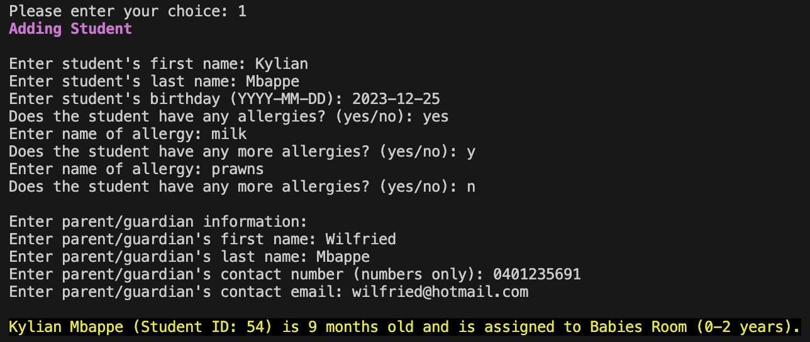
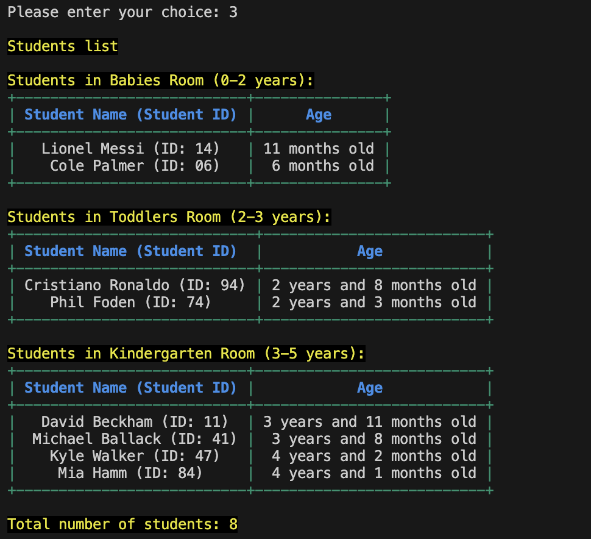

# Childcare Management Application

### Quick Overview
This is a terminal-based command-line interface (CLI) application created to manage both students and kitchen operations at a childcare center with a maximum capacity of 100 students. The application enables users to add, view, and delete student records, access details about their parents or guardians, manage daily kitchen menus, and track students' allergies efficiently.

## Table of Contents

## Application Setup
Users can clone or fork the code of the application from its [GitHub repository](https://github.com/Donjella/assignment-2-CSA).

The application uses both in-built and external libraries:

1. [Colored](https://pypi.org/project/colored/) - For color and formatting CLI outputs.
2. [Python Random Module](https://docs.python.org/3/library/random.html) - Built-in Python module for generating unique student IDs.
3. [Python datetime module](https://docs.python.org/3/library/datetime.html) - For date handling and age calculations.
4. [Pytest](https://docs.pytest.org/en/latest/) - Python testing framework for running unit tests to ensure code quality.
5. [Pytest Mock](https://pytest-mock.readthedocs.io/en/latest/) - Plugin for using mocker in pytest for mocking input and testing.
6. [JSON](https://docs.python.org/3/library/json.html) - For reading from and writing to JSON files for student and kitchen data persistence.

### Setting Up the Environment
1. Application is written in **Python Version 3.12.5**. Hence, please ensure you have Python 3.12.5 or later installed.
2. Install dependencies using a virtual environment.  

```bash
# to set up virtual environment
python3 -m venv .venv

# activate virtual environment
source .venv/bin/activate
```
3. Create a .gitignore file and add .venv to avoid pushing the virtual environment packages to the GitHub repository.
4. **requirements.txt** file is included in the application's [GitHub repository](https://github.com/Donjella/assignment-2-CSA). Hence, users can quickly install project dependencies once the virtual environment is active.  

```bash
# Install dependencies from requirements.txt.
pip install -r requirements.txt

# ONLY if you wish to install dependencies manually. If you have installed from requirements.txt, you can ignore these:
pip install colored
pip install pytest
pip install pytest-mock
```


## Using the application 
### Running the application

Navigate to the root directory of the project (where main.py is located).
```bash
# Start the application
python3 main.py
```
### Main Menu
Once application starts, you will be greeted with a welcome message, 2 management options to choose from (students or kitchen) and a third option to exit the application itself.

1. Students  
2. Kitchen
3. Exit

### Option 1 - Student Management Menu
Choosing option 1 will lead you to the Student Management Menu

1. Add Student 
2. Delete Student
3. List Students
4. Display Parent/Guardian Details
5. Save changes or/and return to the main menu

### Choice 1 - Add Student

You will be prompted one question at a time asking for the following input:

- Student's first name: 
- Student's last name:
- Student's birthday: *in YYYY-MM-DD format
- Does the student have any allergies?: *Yes or No answers
  - If yes, student will be prompted to enter what he/she is allergic to.
  - After entering allergy name, you will be prompted to enter if she has any more allergy.
  - If yes, prompt for allergy name again. If answer is no to allergy questions, you may proceed with parent/guardian details. 
- Enter guardian's first name:
- Enter guardian's last name:
- Enter guardian's contact number: 
- Enter guardian's email address:

Upon successfully entering all details above, you will be greeted with a confirmation message in yellow with black background that student is assigned to his/her respective classroom base on his/her age.



### Choice 2 - Delete Student

You will be prompted to enter student ID of student to be deleted:

- Enter the student's student ID to delete:

Upon entering a valid (existing student ID associated with a student enrolled in a class), a confirmation of deletion of student will be printed.


### Choice 3 - List Students

A lists of student categorised in their respective classrooms (Babies, Toddlers and Kindergarten) will be printed with their first and last names, age and student ID. Total number of students enrolled in the childcare service will also be shown.



### Choice 4 - Display Parent/Guardian Details

You will be prompted to enter student ID to view the particular student's parent/guardian details:

- Enter the student's student ID to view his/her guardian details:

Upon entering a valid (existing student ID associated with a student enrolled in a class), his/her guardian details (name, contact number and email) will be printed.


### Choice 5 - Save changes and return to the main menu

### Important:
***To successfully save changes*** made to students (Addition or deletion of student) so that it will load the changes when you exit the student management menu or start the application again, ***you have to choose option 5 - save changes and return to the main menu***.  


Ensure you ***see the confirmation prompt in yellow and black*** that changes in the student menu is successfully saved to confirm you have exited the student management menu and changes are saved.

---

## Option 2 - Kitchen Management Menu
Choosing option 2 will lead you to the kitchen Management Menu

1. Add/Update menu for the day
2. Delete menu for the Day
3. List menu for the Week
4. List students with allergies
5. Save changes or/and return to the main menu

### Choice 1 - Add/Update menu for the day

You will be prompted one question at a time asking for the following input:

- Enter week number: Enter a number (inclusive of) between 1 to 52 to indicate which week of the year to add menu to.
- Enter the day of the week: Enter number only. i.e. (1 = Monday, 2 = Tuesday...5 = Friday)
Once successful, you will be prompted for:
- Enter name of breakfast dish:
- Enter name of lunch dish:
- Enter name of afternoon tea dish:   


Upon successfully entering the information above, you will receive a confirmation stating menu for selected day in selected week is updated.

### Choice 2 - Delete menu for the day

You will be prompted one question at a time asking for the following input:

- Enter week number: Enter a number (inclusive of) between 1 to 52 to indicate which week of the year to delete menu from. 
- Enter the day of the week to delete menu from: Enter number only. i.e. (1 = Monday, 2 = Tuesday...5 = Friday)


Upon successfully entering the information above, you will receive a confirmation stating that the menu for selected day in selected week has been deleted.

### Choice 3 - List menu for the week
      
You will be prompted one question at a time asking for the following input:

- Enter week number: Enter a number (inclusive of) between 1 to 52 to indicate which week of the year to list menu

Upon successfully entering the information above, you will be shown the menu (Breakfast, Lunch and Afternoon Tea) for each day of the week.

### Choice 4 - List student with allergies
      
A list of students with allergies will be printed in a table. The list is sorted by the student's classrooms, i.e. students are grouped together by their classrooms.


### Choice 5 - Save changes and return to the main menu**

### Important:
***To successfully save changes*** made to the kitchen menu (add/update/delete) so that it will load the changes when you exit the kitchen management menu or start the application again, ***you have to choose option 5 - save changes and return to the main menu***.  


Ensure you ***see the confirmation prompt in yellow and black*** that changes in the kitchen menu is successfully saved to confirm you have exited the kitchen management menu and changes are saved.

---

## Test